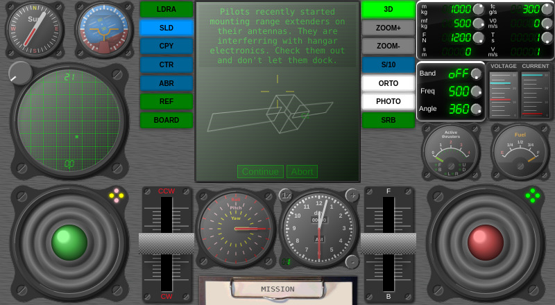

# game-callisto-space-simulator
Newtonian non-relativistic current technology real-time space simulator with visual and instrumental flight

(click on image to play in browser)

### Support

You can support development on [Patreon](https://www.patreon.com/DusanHalicky) or you can hire me via [Upwork](https://www.upwork.com/freelancers/~013b4c3d6e772fdb01)
